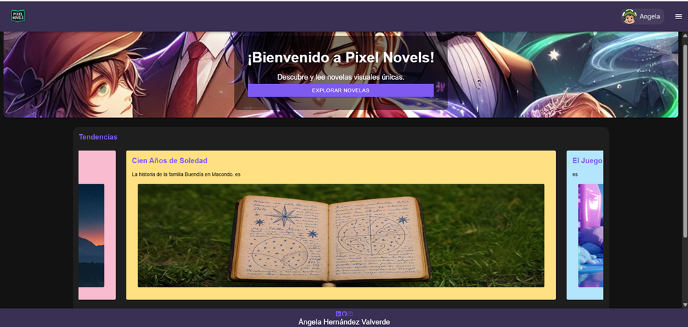
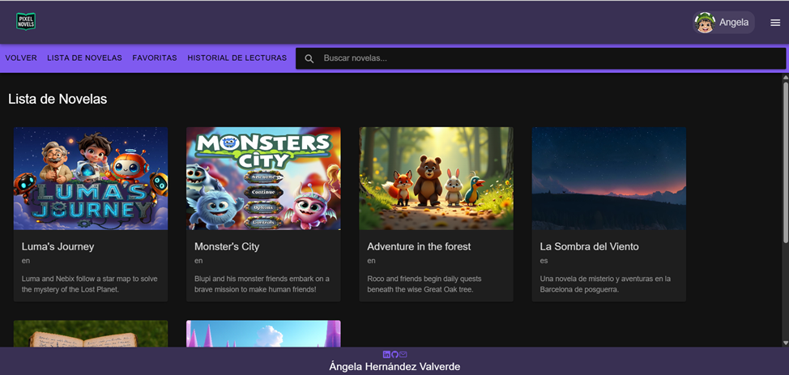
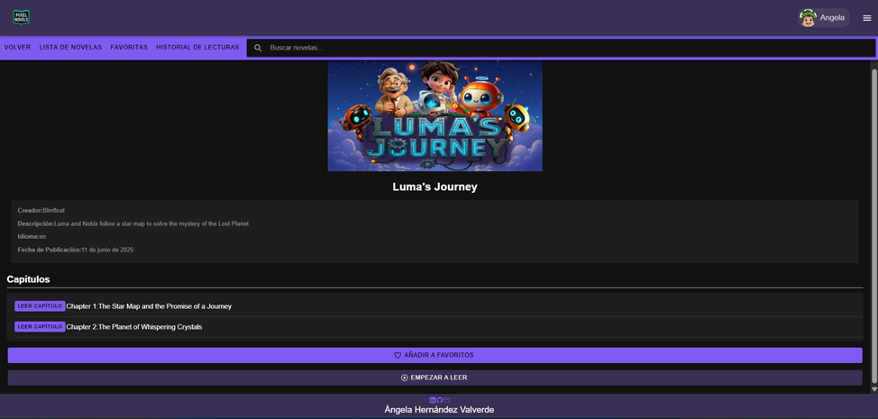
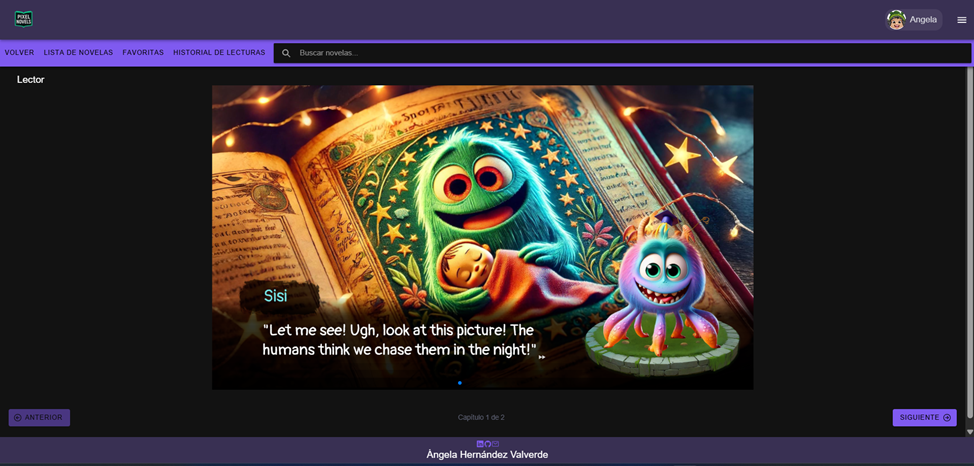
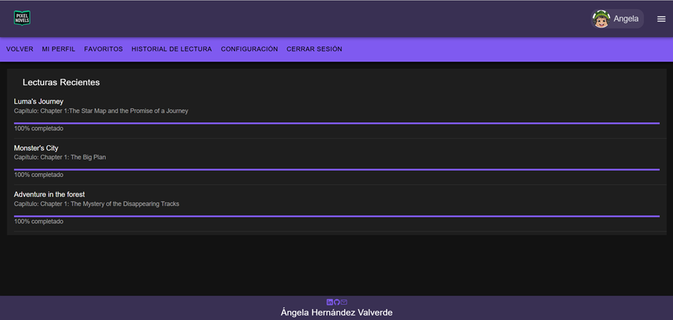
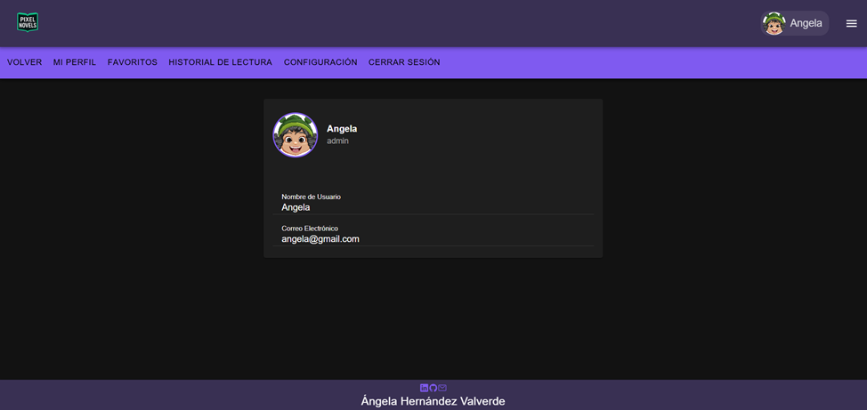

# 📖 Pixel Novels - Frontend
Este repositorio contiene la aplicación cliente para el proyecto Pixel Novels, una plataforma para la distribución de novelas visuales. Desarrollada con Ionic y Vue.js, esta aplicación es multiplataforma y ofrece una experiencia de usuario fluida y moderna para consumir contenido interactivo en la web, iOS y Android.

## ✨ Características Principales
- Multiplataforma: Construido con Ionic para funcionar como una aplicación web (PWA) y nativa en iOS y Android con una sola base de código.
- Interfaz Reactiva: Desarrollada con Vue.js 3 y la Composition API para una experiencia de usuario rápida y dinámica.
- Catálogo Interactivo: Vistas para explorar, buscar y filtrar novelas visuales.
- Lector Multimedia: Componente personalizado para leer novelas en formato texto, imagen o vídeo.
- Gestión de Perfil: Secciones para que los usuarios vean sus novelas favoritas, su progreso de lectura y personalicen su perfil.
- Panel de Creación: Interfaz para que los creadores puedan gestionar sus obras.

## 📸 Capturas de Pantalla
| Inicio | Catálogo de Novelas | Detalles de la Novela | Lector de Capítulos | Historial de Lectura | Perfil de Usuario |
| :---: | :---: | :---: | :---: | :---: | :---: |
| |  |  |  |  |  |

## 🛠️ Tecnologías Utilizadas
- Frameworks: Ionic y Vue.js 
- Lenguajes: TypeScript y JavaScript
- Herramientas de Build: Vite
- Estilos: HTML5 y CSS3

## 🚀 Instalación y Puesta en Marcha
Para ejecutar esta aplicación en tu entorno local, sigue estos pasos:

### 1. Prerrequisitos
Asegúrate de tener instalado Node.js y npm. El backend de Pixel Novels debe estar ejecutándose para que la aplicación funcione correctamente.

### 2. Instalación

#### 1. Clona el repositorio
git clone https://github.com/angelaherval96/frontend-pixel-novels
cd frontend-pixel-novels

#### 2. Instala las dependencias
npm install

#### 3. Configura la URL de la API
Crea un archivo .env en la raíz del proyecto y añade la siguiente línea:
VITE_API_BASE_URL=http://localhost:8000/api

### 3. Ejecución

#### Inicia el servidor de desarrollo
npm run dev / ionic s
La aplicación estará disponible en http://localhost:5173 (o el puerto que te indique la terminal).

📄 Licencia
Este proyecto está bajo la Licencia MIT.
